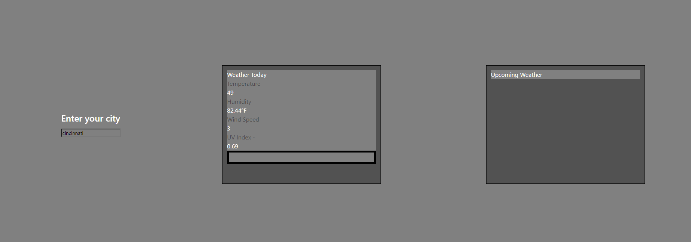

## 01 Weather API App

## 02 Description

For this challenge I have created a weather API application that receives the name of a city, takes the coordinates, and returns weather information for the input city, and displays it to the page.

## 03 Tools

This web application uses the Openrouteservice API to generate coordinates, and uses the openweathermap API to receive weather data.

## 04 Authors

This web application was developed by Michael Bono (github [!https://github.com/bonomichael98])

## 05 Links

Link to deployed application [!https://bonomichael98.github.io/weather-api/]

